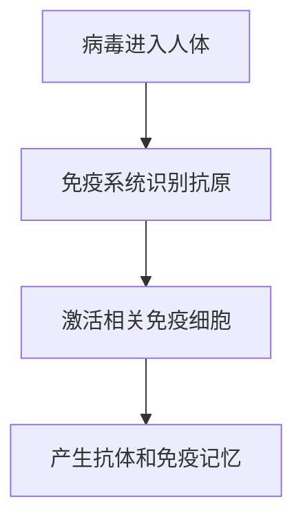

默认开发假设：先做一个 **MVP 可演示项目**，核心不是把所有科学领域都做全，而是把“画像闭环 + 事实校验 + 人味化表达 + 多模态展示 + 评估看板”完整跑通。推荐先选一个主演示主题，例如：**免疫系统如何识别病毒**。这个主题足够科学、适合分层讲解，也方便做图解和漫画。

## 总体产品目标

项目名称建议：**知己科教 Agent**

一句话定位：

> 一个能记住用户认知特点、严格锁定科学事实、把专业知识讲得像真人老师一样自然的科教智能体。

核心闭环必须实现：

```text
用户输入
→ 判断科教场景
→ 检查用户授权
→ 采集/召回用户画像
→ 检索科学知识
→ 锁定事实边界
→ 调用 Qwen 生成初稿
→ 幻觉与风险校验
→ 人味化表达改写
→ 用户反馈
→ 修正回答或更新画像
→ 记录迭代证据
```

推荐目录结构：

```text
science-agent/
  frontend/
  backend/
  data/
    knowledge/
    eval/
    demo/
  docs/
    product-plan.md
    scoring-map.md
    demo-script.md
  finetune/
    datasets/
    scripts/
  screenshots/
  README.md
  .env.example
```

---

# 模块 1：项目场景与演示主线模块

## 模块核心目标

建立一个可以贯穿开发、演示、评分的主线场景，避免项目变成零散功能堆砌。

本模块要定义：

1. 项目服务哪些用户。
2. 用户在哪些科教场景使用。
3. 每个场景下智能体应该输出什么。
4. 演示视频怎么在 10 分钟内完整展示闭环。

## 核心功能设计

需要内置 4 个标准场景：

```text
1. 科普传播场景
   用户目标：把科学概念讲给普通大众。
   输出形式：短文、口播稿、公众号风格科普文案。

2. 课堂教学场景
   用户目标：让学生听懂并能回答问题。
   输出形式：课堂讲稿、板书提纲、互动提问、课后小测。

3. 科研展示场景
   用户目标：把研究内容讲给评委、同学或跨学科听众。
   输出形式：汇报大纲、摘要、PPT 讲稿、答辩问答。

4. 长期学习陪伴场景
   用户目标：持续学习某个科学主题。
   输出形式：分阶段学习计划、复习问题、错因分析、下一课建议。
```

需要内置 3 类演示用户：

```text
用户 A：高一学生
- 知识基础：高中生物基础较弱
- 兴趣偏好：喜欢航天、游戏化类比
- 表达偏好：不要太学术，喜欢一步步讲
- 阶段目标：准备课堂展示

用户 B：大学低年级学生
- 知识基础：知道基本术语，但概念不稳
- 兴趣偏好：喜欢机制图和因果链
- 表达偏好：可以接受专业术语，但需要解释
- 阶段目标：准备课程汇报

用户 C：科研新手
- 知识基础：具备专业基础
- 兴趣偏好：关注证据来源和研究边界
- 表达偏好：严谨、克制、可用于组会
- 阶段目标：准备科研展示
```

## 技术实现路径

创建场景配置文件：

```json
{
  "scenarios": [
    {
      "id": "popular_science",
      "name": "科普传播",
      "output_types": ["short_article", "script", "comic"],
      "requires_profile": true,
      "requires_fact_check": true,
      "style": "natural_public_friendly"
    },
    {
      "id": "classroom_teaching",
      "name": "课堂教学",
      "output_types": ["lesson_plan", "quiz", "blackboard_outline"],
      "requires_profile": true,
      "requires_fact_check": true,
      "style": "teacher_like"
    }
  ]
}
```

后端实现 `ScenarioRouter`：

```text
输入：用户问题、当前页面场景、历史对话
输出：scenario_id、输出类型、是否需要画像、是否需要知识检索、风险等级
```

## 对应赛事得分点

```text
科学价值：
- 内容转化、解释与展示清晰度
- 作品主题完整性与一致性

技术深度：
- 智能体编排完整性

应用潜力：
- 真实场景使用价值
- 演示入口完整度
```

## 交付验收标准

1. 前端能选择 4 个场景。
2. 同一个科学问题在不同场景下输出不同内容。
3. 演示脚本可以完整覆盖：提问、画像、事实校验、人味化、反馈优化。
4. `docs/demo-script.md` 写清楚 10 分钟演示流程。

---

# 模块 2：科学知识库与资料转 Skill 模块

## 模块核心目标

把教材、论文、科普资料、网页内容转成系统可检索、可引用、可复用的科学知识库。

这个模块的核心原则是：

> 模型不能凭空讲科学知识，必须先从可信资料中取证，再生成回答。

## 核心功能设计

支持上传资料：

```text
1. PDF
2. Markdown
3. TXT
4. 网页链接
5. 手动粘贴文本
```

资料处理后生成 5 类结构化内容：

```text
1. 核心概念
   例如：抗原、抗体、T 细胞、B 细胞、免疫记忆。

2. 标准定义
   每个定义保留来源、页码或段落。

3. 因果机制
   例如：病毒进入人体 → 抗原呈递 → 免疫细胞识别 → 产生抗体。

4. 常见误解
   例如：抗体不是万能屏障；免疫反应过强也可能造成伤害。

5. 表达素材
   例如：适合中学生的类比、适合科研汇报的术语表达。
```

## 技术实现路径

后端流程：

```text
上传文件
→ 文档解析
→ 文本清洗
→ 按章节和语义切块
→ 调用 Qwen 抽取结构化知识
→ 生成向量
→ 写入向量库
→ 保存来源信息
```

建议数据表：

```text
knowledge_documents
- id
- title
- source_type
- file_path
- url
- trust_level
- created_at

knowledge_chunks
- id
- document_id
- chunk_text
- page_number
- section_title
- embedding
- created_at

knowledge_facts
- id
- chunk_id
- fact_type
- subject
- predicate
- object
- evidence_text
- confidence
```

生成 Skill 文件：

```yaml
skill_id: immunology_basic
title: 免疫系统基础知识
audience:
  - middle_school
  - high_school
  - undergraduate
core_concepts:
  - 抗原
  - 抗体
  - 免疫记忆
common_misconceptions:
  - 抗体不是立即产生的
  - 免疫系统不是越强越好
evidence_policy:
  require_source_for:
    - 数字
    - 实验结论
    - 医学建议
    - 因果机制
```

## 对应赛事得分点

```text
科学价值：
- 科学事实表达准确性
- 内容解释清晰度

技术深度：
- 技能设计完整性
- 结果校验基础能力

应用潜力：
- 流程可复现性
```

## 交付验收标准

1. 能上传至少 3 份科学资料。
2. 能在回答中显示引用来源。
3. 能生成一个 `knowledge_skill.yaml`。
4. 任意关键事实能追溯到原文片段。
5. README 中写清楚如何重新导入资料。

---

# 模块 3：数字分身用户画像 Schema 模块

## 模块核心目标

建立一个结构化、可解释、可授权的用户画像系统。

画像不是简单记忆聊天内容，而是记录“对科教表达有用的认知信息”。

## 核心功能设计

画像必须覆盖 8 类字段：

```text
1. 基本情况
   年级、专业、年龄段、学习背景。

2. 阶段目标
   备考、课堂展示、科研汇报、长期兴趣学习。

3. 知识储备水平
   对某一主题的掌握程度。

4. 兴趣偏好
   喜欢的例子、类比、媒介形式。

5. 表达习惯
   喜欢简短、详细、图解、故事化、严谨表达。

6. 情绪变化特征
   是否容易焦虑、是否需要鼓励、是否反感说教。

7. 核心待解决问题
   当前最困扰用户的学习卡点。

8. 信息授权边界
   哪些信息可记忆，哪些只在本轮使用，哪些禁止使用。
```

每一条画像都必须包含证据：

```json
{
  "profile_key": "interest_preference",
  "value": "喜欢航天相关类比",
  "evidence": "用户说：我比较喜欢航天，能不能用火箭举例",
  "confidence": 0.92,
  "source_conversation_id": "conv_001",
  "user_confirmed": true,
  "scope": "learning_context",
  "expires_at": null
}
```

## 技术实现路径

数据表建议：

```text
user_profiles
- id
- user_id
- profile_key
- profile_value
- confidence
- user_confirmed
- scope
- authorization_status
- created_at
- updated_at

profile_evidence
- id
- profile_id
- conversation_id
- evidence_text
- extraction_reason
- created_at

profile_update_logs
- id
- user_id
- old_value
- new_value
- update_reason
- update_type
- created_at
```

画像置信度规则：

```text
0.3 以下：不写入画像，只作为本轮上下文。
0.3 - 0.7：写入候选画像，等待用户确认。
0.7 以上：如果用户明确表达，可写入画像，但仍允许撤回。
用户手动确认：置信度设为 1.0。
用户手动修改：以用户修改为最高优先级。
```

## 对应赛事得分点

```text
技术深度：
- 智能体与技能设计完整性
- 反馈迭代与稳定性设计

应用潜力：
- 长期学习陪伴价值
- 代码和流程可复现性
```

## 交付验收标准

1. 系统能从对话中提取画像候选。
2. 每条画像都能看到证据来源。
3. 画像字段有置信度和授权状态。
4. 用户可以确认、修改、删除画像。
5. 系统不能使用未授权画像。

---

# 模块 4：画像采集、确认、更新与撤回模块

## 模块核心目标

完整实现用户画像生命周期管理。

必须展示：

```text
采集 → 候选 → 用户确认 → 场景化调用 → 用户反馈 → 更新或撤回
```

## 核心功能设计

画像采集触发条件：

```text
1. 用户明确自述
   “我是高一学生。”
   “我不喜欢太正式的表达。”

2. 用户重复表现出稳定偏好
   多次要求“讲简单点”“举生活例子”。

3. 用户纠正系统
   “你别默认我是小学生，我是大学生。”

4. 用户授权发生变化
   “以后别记我的情绪状态。”

5. 学习目标变化
   “我现在不是备考了，我要准备答辩。”
```

用户交互路径：

```text
对话中检测到画像候选
→ 前端弹出轻量确认
→ 用户选择：
   1. 记住
   2. 只本次使用
   3. 不要记
   4. 修改后记住
```

画像管理页面功能：

```text
1. 查看全部画像
2. 按类型筛选画像
3. 查看证据来源
4. 修改画像内容
5. 删除单条画像
6. 暂停全部记忆
7. 导出画像数据
8. 撤回某类授权
```

## 技术实现路径

实现后端服务：

```text
ProfileExtractor
- 输入：当前用户消息、历史摘要
- 输出：画像候选列表

ProfileConsentManager
- 输入：候选画像、用户操作
- 输出：写入、拒绝、仅本轮使用

ProfileUpdater
- 输入：新画像、旧画像、冲突情况
- 输出：更新、合并、进入待确认
```

更新冲突策略：

```text
如果用户新说法与旧画像冲突：
- 不直接覆盖。
- 标记为 conflict。
- 前端提示：你之前说喜欢详细解释，现在说想要简短回答，要更新偏好吗？
```

## 对应赛事得分点

```text
技术深度：
- 多轮反馈后的持续迭代优化
- 稳定性设计

应用潜力：
- 真实长期使用价值
- 交互入口完整度
```

## 交付验收标准

1. 对话中能自动发现画像候选。
2. 用户可以选择是否记住。
3. 用户修改画像后，下一轮回答立即变化。
4. 撤回授权后，系统日志显示该字段未被调用。
5. 能展示画像更新历史。

---

# 模块 5：画像场景化召回模块

## 模块核心目标

让画像真正影响回答，而不是只存在数据库里。

## 核心功能设计

画像召回时需要判断：

```text
1. 当前任务是否需要画像？
   例如事实查询可能不需要太多个性化；教学解释需要。

2. 当前场景需要哪类画像？
   科普文案：兴趣偏好、表达习惯。
   课堂教学：知识水平、阶段目标。
   科研汇报：知识水平、表达风格、证据偏好。
   长期陪伴：阶段目标、历史卡点、情绪变化。

3. 该画像是否被授权？
   未授权不得调用。

4. 该画像是否过期？
   例如“下周期末考试”过期后不能继续强召回。
```

召回评分公式：

```text
score =
场景相关性 * 0.35
+ 画像置信度 * 0.25
+ 用户确认权重 * 0.20
+ 新鲜度 * 0.10
+ 历史有效性 * 0.10
```

只召回 Top 5 条画像，避免提示词污染。

## 技术实现路径

实现 `ProfileRetriever`：

```text
输入：
- user_id
- scenario_id
- user_query
- output_type

输出：
- selected_profiles
- reject_profiles
- retrieval_reason
```

返回示例：

```json
{
  "selected_profiles": [
    {
      "key": "knowledge_level",
      "value": "高中生物基础较弱",
      "reason": "当前问题需要分层解释免疫机制"
    },
    {
      "key": "interest_preference",
      "value": "喜欢航天类比",
      "reason": "可用于降低理解门槛"
    }
  ]
}
```

## 对应赛事得分点

```text
科学价值：
- 内容解释清晰度

技术深度：
- 智能体编排完整性
- 反馈迭代稳定性

应用潜力：
- 个性化学习价值
```

## 交付验收标准

1. 同一问题在不同画像下输出不同解释。
2. 回答旁边显示“本轮使用了哪些画像”。
3. 未授权画像不会出现在召回日志中。
4. 用户反馈“这个例子不喜欢”后，后续召回权重下降。

---

# 模块 6：科学事实锁定与幻觉抑制模块

## 模块核心目标

保障科学事实准确，形成可复现的幻觉抑制机制。

核心原则：

> 先确定能说什么，再决定怎么说。

## 核心功能设计

回答前先生成事实清单：

```text
1. 可确认事实
   有明确来源支持，可以写入回答。

2. 不确定事实
   来源不足，只能保守表达。

3. 禁止扩展事实
   没有证据，不能编造。

4. 风险事实
   涉及医学、安全、实验操作、数字、公式、因果结论，需要额外校验。
```

风险信号识别：

```text
1. 出现具体数字
2. 出现绝对化表达
   “一定”“完全”“必然”“所有”

3. 出现医学建议
4. 出现实验安全操作
5. 出现论文结论外推
6. 出现因果关系
7. 出现争议性科学观点
```

回答后做逐句校验：

```text
生成回答
→ 拆成句子
→ 判断每句是否有证据支持
→ 无证据句标红
→ 尝试补充检索
→ 仍无证据则删除或降级表达
```

## 技术实现路径

实现服务：

```text
FactRetriever
- 从知识库检索相关证据

FactLockBuilder
- 生成可用事实清单

RiskSignalDetector
- 检测高风险表达

ClaimVerifier
- 对回答逐句校验

AnswerRepairer
- 修复无证据或过度表达
```

回答提示词必须分两步：

```text
第一步：只输出事实清单，不写成文章。

第二步：基于事实清单生成回答，不得加入事实清单之外的新结论。
```

校验指标：

```text
unsupported_claim_rate：无证据断言比例
citation_coverage：关键事实引用覆盖率
risk_detection_recall：风险信号召回率
overclaim_count：夸大结论次数
```

## 对应赛事得分点

```text
科学价值：
- 科学事实表达准确性

技术深度：
- 结果校验
- 反馈迭代
- 稳定性设计

加分项：
- 可复现幻觉抑制机制
```

## 交付验收标准

1. 至少准备 30 条科学陷阱题。
2. 系统能识别无来源、过度外推、绝对化表述。
3. 回答中关键事实有来源。
4. 前端能展示事实校验过程。
5. 生成 `eval/fact_check_report.html`。

---

# 模块 7：科教人味化表达模块

## 模块核心目标

在不改变科学事实的前提下，让回答更像真人老师、科普作者或科研汇报者。

## 核心功能设计

人味化不是简单“口语化”，而是按场景调整表达。

支持 5 种风格：

```text
1. 科普作者风格
   自然、有画面感、有节奏，但不夸张。

2. 课堂老师风格
   分步骤、会停顿、会提醒学生容易误解的地方。

3. 科研汇报风格
   克制、准确、有证据边界。

4. 论文辅助风格
   术语规范、逻辑严密、少口语。

5. 长期陪伴风格
   贴近用户当前状态，有分寸地鼓励，不油腻。
```

AI 味检测维度：

```text
1. 模板化开头
   “在当今时代”“总的来说”“需要注意的是”。

2. 过度排比
   “不仅……而且……同时……此外……”

3. 空泛总结
   “具有重要意义”“值得深入研究”。

4. 机翻感长句
   主谓宾不自然，定语过长。

5. 语气过度标准化
   像说明书，不像人讲话。

6. 逻辑连接词堆叠
   “首先、其次、再次、最后”机械出现。
```

## 技术实现路径

实现 `HumanizationPipeline`：

```text
输入：
- fact_locked_answer
- scenario_id
- selected_profiles
- forbidden_changes

步骤：
1. 锁定不可改内容
   数字、术语、定义、引用、结论边界。

2. 检测 AI 痕迹
   给出问题标签。

3. 场景化改写
   根据场景和画像调整语气、节奏、例子。

4. 事实回归校验
   检查改写后是否改变事实。

5. 输出最终文本和改写报告。
```

输出示例：

```json
{
  "final_text": "...",
  "humanization_report": {
    "removed_ai_patterns": ["模板化总结", "过度排比"],
    "preserved_terms": ["抗原", "抗体", "免疫记忆"],
    "fact_changed": false
  }
}
```

## 对应赛事得分点

```text
科学价值：
- 内容表达清晰度
- 主题一致性

技术深度：
- 技能设计完整性
- 结果校验

应用潜力：
- 科普、课堂、科研展示真实价值
```

## 交付验收标准

1. 同一事实清单能生成 5 种不同风格。
2. 人味化前后事实一致。
3. AI 痕迹检测能输出标签。
4. 人工评测中，人味化版本自然度明显高于原始版本。
5. 前端能展示“原文 / 人味化后 / 修改原因”。

---

# 模块 8：长期学习陪伴与教学 Skill 模块

## 模块核心目标

让项目从一次性问答升级为长期陪伴型科教智能体。

## 核心功能设计

借鉴 `teach` 的学习工作区思想，为每个用户维护：

```text
1. 学习使命
   用户为什么学这个主题。

2. 学习记录
   每次学到了什么，卡在哪里。

3. 参考资料
   系统使用过哪些可信来源。

4. 课程单元
   每次生成一个小课。

5. 复习任务
   根据历史卡点生成问题。

6. 下一步建议
   根据用户掌握程度推荐下一课。
```

需要实现 5 个教学 Skill：

```text
1. explain-skill
   把概念讲清楚。

2. analogy-skill
   根据用户兴趣生成类比。

3. quiz-skill
   生成小测题并即时反馈。

4. misconception-skill
   检测常见误解。

5. next-lesson-skill
   根据学习记录规划下一步。
```

## 技术实现路径

学习记录数据表：

```text
learning_records
- id
- user_id
- topic
- learned_points
- confusion_points
- quiz_result
- recommended_next_step
- created_at
```

每轮学习结束自动生成：

```json
{
  "topic": "免疫记忆",
  "learned_points": ["知道抗体不是立即产生", "理解免疫记忆的作用"],
  "confusion_points": ["仍不清楚 B 细胞和 T 细胞区别"],
  "next_step": "下一课建议学习抗原呈递"
}
```

## 对应赛事得分点

```text
科学价值：
- 分层解释清晰度

技术深度：
- Skills 设计完整性
- 多轮反馈迭代

应用潜力：
- 长期学习陪伴价值
```

## 交付验收标准

1. 连续三轮学习后，系统能总结用户掌握情况。
2. 能基于卡点生成下一课。
3. 能生成小测题并给反馈。
4. 学习记录会影响后续回答。
5. 前端有学习档案页。

---

# 模块 9：多模态科教内容生成模块

## 模块核心目标

把科学内容转成更适合展示和传播的多模态材料。

## 核心功能设计

支持生成：

```text
1. 知识卡片
   一屏讲清一个概念。

2. 课堂板书
   适合老师上课使用。

3. 汇报大纲
   适合科研展示或课程汇报。

4. 漫画分镜
   把科学机制转成四格漫画。

5. 流程图
   展示机制、因果链、实验步骤。

6. 小测题
   检查用户是否理解。
```

漫画生成要求：

```text
1. 先生成科学事实清单。
2. 再生成分镜。
3. 每格画面只能表达事实清单中的内容。
4. 对白要自然，但不能夸大。
5. 最后做事实一致性检查。
```

## 技术实现路径

实现接口：

```text
POST /artifact/generate

输入：
- topic
- scenario_id
- artifact_type
- user_id
- style_preference

输出：
- artifact_content
- evidence_links
- generation_report
```

流程图可以优先用 Mermaid：



## 对应赛事得分点

```text
科学价值：
- 内容展示清晰度

技术深度：
- 多模态数据生成和交互能力

应用潜力：
- 演示完整度
```

## 交付验收标准

1. 能从同一主题生成 4 种以上内容形态。
2. 每种内容都有来源依据。
3. 前端可预览、复制、下载。
4. 漫画分镜不出现无依据科学结论。
5. 演示视频中至少展示一种图解或漫画。

---

# 模块 10：用户反馈与回答优化闭环模块

## 模块核心目标

实现赛事加分项要求的完整闭环。

必须能展示：

```text
画像采集记录
→ 场景化召回画像
→ 生成回答
→ 用户反馈
→ 修正画像或优化回答
→ 多轮后效果变好
```

## 核心功能设计

反馈按钮：

```text
1. 太难了
2. 太浅了
3. 不够自然
4. 太像 AI
5. 事实可疑
6. 例子不喜欢
7. 语气不合适
8. 这个画像不对
```

反馈处理规则：

```text
太难了：
- 降低知识层级
- 增加类比
- 更新用户知识水平候选

太浅了：
- 提高专业度
- 增加术语和机制
- 更新知识水平候选

事实可疑：
- 触发事实复查
- 展示来源
- 必要时修正回答

例子不喜欢：
- 降低该兴趣偏好权重
- 询问是否更新画像

这个画像不对：
- 进入画像修正流程
```

## 技术实现路径

实现 `FeedbackRouter`：

```text
输入：
- answer_id
- feedback_type
- feedback_text
- user_id

输出：
- action_type:
  - regenerate_answer
  - verify_fact
  - update_profile
  - ask_user_confirm
  - lower_profile_weight
```

记录迭代日志：

```text
answer_iterations
- id
- answer_id
- iteration_number
- user_feedback
- changed_profiles
- changed_facts
- changed_style
- before_text
- after_text
```

## 对应赛事得分点

```text
技术深度：
- 反馈迭代与稳定性设计

应用潜力：
- 真实使用价值
- 演示完整度

加分项：
- 多轮闭环优化效果
```

## 交付验收标准

1. 用户点反馈后，系统能判断处理路径。
2. 至少支持 3 轮回答迭代。
3. 前端能对比第一版和最终版。
4. 迭代日志能显示画像和回答如何变化。
5. 演示中必须展示一次“画像修正”和一次“回答改写”。

---

# 模块 11：评估体系与评分看板模块

## 模块核心目标

把项目优势量化，方便赛事评委快速看到效果。

## 核心功能设计

评估分 3 类：

```text
1. 画像理解评估
   AI 是否正确理解用户。

2. 科学事实评估
   回答是否准确、有证据、不幻觉。

3. 人味化表达评估
   回答是否自然、像人、有场景适配性。
```

指标设计：

```text
画像指标：
- profile_precision：画像提取准确率
- profile_recall：应提取画像召回率
- over_inference_rate：过度推断率
- consent_violation_rate：授权违规率

事实指标：
- citation_coverage：引用覆盖率
- unsupported_claim_rate：无证据断言率
- risk_signal_recall：风险信号召回率
- fact_consistency_score：事实一致性分

表达指标：
- ai_trace_score：AI 痕迹分
- naturalness_score：自然度
- scenario_fit_score：场景适配度
- human_preference_rate：人工偏好胜率
```

## 技术实现路径

准备评估集：

```text
data/eval/profile_cases.jsonl
- 50 条画像提取测试

data/eval/fact_cases.jsonl
- 30 条科学事实与陷阱问题

data/eval/humanization_cases.jsonl
- 50 条人味化改写测试
```

前端看板展示：

```text
1. 雷达图
2. 迭代前后对比柱状图
3. 幻觉率下降曲线
4. 人味化评分提升曲线
5. 授权违规次数
```

## 对应赛事得分点

```text
科学价值：
- 事实准确性

技术深度：
- 结果校验和稳定性

应用潜力：
- 流程可复现性
```

## 交付验收标准

1. 一键运行评估脚本。
2. 生成 HTML 评估报告。
3. 看板能展示核心指标。
4. 能展示多轮反馈后指标提升。
5. 评估数据和脚本可复现。

---

# 模块 12：Qwen / 百炼调用与微调预留模块

## 模块核心目标

满足赛事硬性技术约束：基座模型必须采用千问 Qwen 系列，并通过百炼或赛事指定工具调用，同时支持微调扩展。

## 核心功能设计

必须实现：

```text
1. Qwen API 调用封装
2. 模型调用日志
3. 凭证环境变量配置
4. 百炼控制台截图留存方案
5. 微调数据集预留
6. 微调前后评估对比预留
```

## 技术实现路径

环境变量：

```text
DASHSCOPE_API_KEY=
QWEN_MODEL=qwen-plus
QWEN_BASE_URL=
```

模型调用封装：

```text
LLMClient
- chat()
- structured_output()
- embedding()
- rerank 可选
```

调用日志：

```text
model_call_logs
- id
- model_name
- prompt_type
- input_tokens
- output_tokens
- latency
- success
- created_at
```

微调目录：

```text
finetune/
  datasets/
    science_qa.jsonl
    humanization_pairs.jsonl
    profile_adaptation.jsonl
  scripts/
    prepare_dataset.py
    train_lora.md
    evaluate_finetuned_model.py
  reports/
```

微调样本格式：

```json
{
  "instruction": "请面向高中生解释免疫记忆，要求自然但科学准确。",
  "input": "用户画像：高一学生，喜欢航天类比。",
  "output": "可以把免疫记忆想成身体的任务档案..."
}
```

## 对应赛事得分点

```text
技术深度：
- 模型设计完整性
- 支持垂直数据微调

应用潜力：
- 可复现性
```

## 交付验收标准

1. 所有生成能力都通过 Qwen 封装调用。
2. `.env.example` 清楚说明百炼配置。
3. `screenshots/` 保存百炼模型调用截图。
4. 至少准备 200 条微调样本。
5. README 说明如何扩展微调。

---

# 模块 13：前端交互系统模块

## 模块核心目标

做出一个评委能直接操作的完整前端，而不是只有 API。

## 核心页面设计

需要 6 个页面：

```text
1. 对话工作台
   核心聊天页面。

2. 我的画像
   查看、修改、撤回授权。

3. 知识库管理
   上传资料、查看知识 Skill。

4. 内容生成工坊
   生成科普文、讲稿、漫画、流程图。

5. 评估看板
   展示事实、人味化、画像指标。

6. 演示模式
   按步骤自动引导评委看完整闭环。
```

对话页布局：

```text
左侧：
- 场景选择
- 受众选择
- 输出类型

中间：
- 对话窗口
- 反馈按钮
- 重新生成按钮

右侧：
- 本轮调用画像
- 本轮引用证据
- 风险校验结果
- 人味化改写报告
```

## 技术实现路径

前端组件：

```text
ChatPanel
ScenarioSelector
ProfileSidebar
EvidencePanel
FeedbackBar
ArtifactPreview
EvaluationDashboard
ConsentModal
```

## 对应赛事得分点

```text
应用潜力：
- 交互入口完整度
- 演示完整度

技术深度：
- 多模块系统集成
```

## 交付验收标准

1. 用户能通过前端完成完整流程。
2. 画像、证据、校验过程可视化。
3. 内容生成结果可复制或下载。
4. 演示模式能按步骤推进。
5. 适配桌面端展示。

---

# 模块 14：测试 API 与复现交付模块

## 模块核心目标

提供可调用 API、文档、演示材料，保证项目可复现。

## 核心 API

```text
POST /api/chat
- 主对话接口

GET /api/profile/{user_id}
- 查看用户画像

POST /api/profile/consent
- 修改画像授权

POST /api/knowledge/upload
- 上传知识资料

POST /api/humanize
- 人味化改写

POST /api/fact-check
- 事实校验

POST /api/artifact/generate
- 生成多模态内容

POST /api/evaluate
- 运行评估

GET /api/demo/reset
- 重置演示数据
```

## 技术实现路径

交付文件：

```text
README.md
- 项目介绍
- 环境变量
- 启动步骤
- API 示例
- 演示流程

docs/scoring-map.md
- 每个模块对应评分点

docs/demo-script.md
- 10 分钟演示脚本

docs/open-source-comparison.md
- 与参考项目横向对比

api_collection.json
- Apifox 或 Postman 接口集合
```

## 对应赛事得分点

```text
应用潜力：
- 交付完整度
- 代码、结果、流程可复现性
```

## 交付验收标准

1. 新机器按 README 能启动项目。
2. API 集合可直接调用。
3. 演示数据可一键重置。
4. 评估报告可重新生成。
5. 视频、截图、代码、文档齐全。

---

# 最小可行版本开发顺序

建议按这个顺序交给 AI 开发：

```text
第一阶段：跑通主链路
1. 后端 API 骨架
2. Qwen 调用封装
3. 对话页
4. 场景选择
5. 基础回答生成

第二阶段：加入知识与事实校验
6. 知识上传
7. 向量检索
8. 事实清单
9. 回答引用
10. 风险检测

第三阶段：加入画像闭环
11. 画像 Schema
12. 画像提取
13. 用户确认
14. 画像召回
15. 画像修改和撤回

第四阶段：加入人味化与反馈
16. AI 味检测
17. 人味化改写
18. 反馈按钮
19. 迭代日志
20. 前后版本对比

第五阶段：加入展示与评估
21. 知识卡片
22. 流程图
23. 漫画分镜
24. 评估数据集
25. 评估看板

第六阶段：赛事交付
26. README
27. API 文档
28. 横向对比报告
29. 百炼截图
30. 10 分钟演示视频
```

## issue列表
假设：项目从空仓库开始，目标是先交付赛事 MVP，而不是一次性做成完整商业产品。

## Issue 01：初始化项目骨架与演示数据

**Blocked by**：None  
**User stories covered**：作为开发者，我能一键启动前后端；作为评委，我能看到可演示的初始数据。  
**What to build**：创建前端、后端、数据目录、环境变量模板、演示主题配置。内置主演示主题“免疫系统如何识别病毒”，以及 3 个演示用户画像。  
**Acceptance criteria**：

- [ ] 项目包含 `frontend`、`backend`、`data`、`docs`、`finetune`、`screenshots` 目录。
- [ ] `.env.example` 包含 `DASHSCOPE_API_KEY`、`QWEN_MODEL`、`QWEN_BASE_URL`。
- [ ] README 能说明如何启动项目。
- [ ] 前端首页能打开，并显示项目名称“知己科教 Agent”。
- [ ] 后端提供 `/api/health`，返回服务状态。

---

## Issue 02：封装 Qwen / 百炼模型调用客户端

**Blocked by**：Issue 01  
**User stories covered**：作为开发者，我希望所有模型调用集中管理，方便替换模型、记录日志和截图留存。  
**What to build**：实现统一 `LLMClient`，业务代码不得直接调用模型 API。支持普通对话、结构化输出、JSON 输出失败重试、调用日志记录。  
**Acceptance criteria**：

- [ ] 后端提供统一模型调用封装。
- [ ] 支持从环境变量读取百炼 / Qwen 配置。
- [ ] 每次调用记录模型名、调用类型、耗时、成功状态。
- [ ] 缺少 API Key 时返回清晰错误，不导致服务崩溃。
- [ ] README 说明如何配置百炼 API Key，并提醒保存百炼控制台截图。

---

## Issue 03：实现基础对话工作台

**Blocked by**：Issue 02  
**User stories covered**：作为用户，我能在网页中向科教智能体提问，并获得基础回答。  
**What to build**：实现前端对话页和 `/api/chat` 接口。第一版不要求画像和知识库，只需跑通用户输入、后端调用 Qwen、前端显示回答。  
**Acceptance criteria**：

- [ ] 前端有对话输入框、发送按钮、消息列表。
- [ ] `/api/chat` 接收 `user_id`、`message`、`scenario_id`。
- [ ] 回答显示在聊天窗口中。
- [ ] 加载中、失败状态有清晰提示。
- [ ] 所有回答经过 `LLMClient` 调用。

---

## Issue 04：场景选择与输出类型路由

**Blocked by**：Issue 03  
**User stories covered**：作为用户，我能选择科普、课堂、科研汇报、长期学习场景，得到不同风格的输出。  
**What to build**：实现 `ScenarioRouter` 和前端场景选择器。不同场景影响提示词、输出结构和后续处理策略。  
**Acceptance criteria**：

- [ ] 前端支持选择 4 个场景：科普传播、课堂教学、科研展示、长期学习陪伴。
- [ ] 后端保存 `scenario_config`。
- [ ] 同一问题在不同场景下生成不同结构回答。
- [ ] 聊天结果显示当前场景名称。
- [ ] 单元测试覆盖场景路由。

---

## Issue 05：知识资料上传与文本切分

**Blocked by**：Issue 01  
**User stories covered**：作为教师或科普作者，我能上传资料，让智能体基于资料回答。  
**What to build**：实现知识库管理页和 `/api/knowledge/upload`。支持上传 TXT / Markdown，先不强制支持 PDF。上传后完成文本清洗、切分、保存。  
**Acceptance criteria**：

- [ ] 前端有知识库管理页。
- [ ] 支持上传 `.txt` 和 `.md`。
- [ ] 后端保存文档标题、来源类型、正文切片。
- [ ] 页面能显示已上传资料列表。
- [ ] 每个切片保留原文内容和顺序编号。

---

## Issue 06：知识 Skill 生成与来源追踪

**Blocked by**：Issue 05、Issue 02  
**User stories covered**：作为评委，我能看到系统把资料转成可复用的科教 Skill，而不是只做普通 RAG。  
**What to build**：上传资料后调用 Qwen 抽取核心概念、定义、常见误解、适用受众，生成 `knowledge_skill` 结构并展示。  
**Acceptance criteria**：

- [ ] 每份资料可生成知识 Skill。
- [ ] Skill 包含核心概念、标准定义、常见误解、适用受众。
- [ ] 每条知识点能追踪到原始切片。
- [ ] 前端能查看 Skill 内容。
- [ ] 生成失败时允许重新生成。

---

## Issue 07：基础知识检索与引用回答

**Blocked by**：Issue 05、Issue 03  
**User stories covered**：作为用户，我希望科学回答有依据，不是模型凭空生成。  
**What to build**：实现简单检索链路。先可用关键词检索或轻量向量检索，目标是回答中能显示引用来源。  
**Acceptance criteria**：

- [ ] `/api/chat` 能检索相关知识切片。
- [ ] 回答生成时注入检索证据。
- [ ] 前端右侧显示“本轮引用证据”。
- [ ] 关键回答至少显示 1 条来源。
- [ ] 无相关资料时，系统明确提示“当前知识库证据不足”。

---

## Issue 08：事实清单与事实锁定流程

**Blocked by**：Issue 07  
**User stories covered**：作为评委，我能看到系统先锁定事实，再进行表达生成。  
**What to build**：在生成最终回答前，先生成结构化事实清单，包括可确认事实、不确定事实、禁止扩展事实。  
**Acceptance criteria**：

- [ ] 后端新增 `FactLockBuilder`。
- [ ] 每次回答先生成事实清单。
- [ ] 最终回答不得加入事实清单外的新关键结论。
- [ ] 前端显示“事实锁定结果”。
- [ ] 日志中保存事实清单和最终回答。

---

## Issue 09：风险信号检测与幻觉抑制

**Blocked by**：Issue 08  
**User stories covered**：作为用户，我希望系统识别科学回答中的高风险表述，避免过度自信和幻觉。  
**What to build**：实现风险检测器，识别数字、绝对化表达、医学建议、因果外推、无证据结论，并在必要时修复回答。  
**Acceptance criteria**：

- [ ] 检测“所有、一定、完全、必然”等绝对化表达。
- [ ] 检测数字、医学建议、实验安全相关句子。
- [ ] 无证据高风险句会被标记。
- [ ] 系统能把过度表述改成保守表达。
- [ ] 前端显示风险检测结果。

---

## Issue 10：用户画像 Schema 与画像管理页

**Blocked by**：Issue 01  
**User stories covered**：作为用户，我能查看系统记住了我什么，也能修改和删除。  
**What to build**：实现用户画像数据结构和“我的画像”页面。画像字段包含基本情况、阶段目标、知识水平、兴趣偏好、表达习惯、情绪特征、核心问题、授权边界。  
**Acceptance criteria**：

- [ ] 后端能保存结构化画像。
- [ ] 每条画像包含证据、置信度、授权状态、更新时间。
- [ ] 前端能查看画像列表。
- [ ] 用户能修改和删除画像。
- [ ] 删除后后续回答不得调用该画像。

---

## Issue 11：对话中提取画像候选

**Blocked by**：Issue 10、Issue 02  
**User stories covered**：作为用户，当我说出学习背景或偏好时，系统能识别为候选画像，而不是直接偷偷记住。  
**What to build**：实现 `ProfileExtractor`，从用户消息中提取画像候选，并在对话页展示确认卡片。  
**Acceptance criteria**：

- [ ] 用户说“我是高一学生”时生成基本情况候选。
- [ ] 用户说“我喜欢航天类比”时生成兴趣偏好候选。
- [ ] 候选画像默认不直接写入已确认画像。
- [ ] 前端提供“记住 / 仅本次 / 不要记 / 修改后记住”。
- [ ] 用户确认后画像写入数据库。

---

## Issue 12：画像授权、撤回与暂停记忆

**Blocked by**：Issue 10、Issue 11  
**User stories covered**：作为用户，我能控制哪些信息能被系统长期使用。  
**What to build**：实现授权管理。用户可撤回单条画像、撤回某类画像授权、暂停全部记忆。  
**Acceptance criteria**：

- [ ] 画像管理页支持撤回授权。
- [ ] 支持暂停全部记忆。
- [ ] 撤回后画像不参与召回。
- [ ] 对话日志显示“该画像因未授权未调用”。
- [ ] 授权变更有操作记录。

---

## Issue 13：画像场景化召回并影响回答

**Blocked by**：Issue 11、Issue 04、Issue 07  
**User stories covered**：作为用户，我希望系统根据我的知识水平、兴趣和表达偏好调整解释方式。  
**What to build**：实现 `ProfileRetriever`。根据场景、问题和授权状态召回 Top 5 画像，并注入回答生成。  
**Acceptance criteria**：

- [ ] 同一问题在不同用户画像下回答不同。
- [ ] 未授权画像不会被召回。
- [ ] 前端显示“本轮调用画像”。
- [ ] 召回结果包含调用理由。
- [ ] 用户反馈不喜欢某类例子后，该偏好权重下降。

---

## Issue 14：人味化表达检测与改写

**Blocked by**：Issue 08、Issue 13  
**User stories covered**：作为用户，我希望回答自然、像真人老师，但科学事实不被改坏。  
**What to build**：实现 `HumanizationPipeline`，检测模板腔、过度排比、空泛总结、机翻感长句，并根据场景进行改写。  
**Acceptance criteria**：

- [ ] 输出人味化前后对比。
- [ ] 人味化报告显示移除了哪些 AI 痕迹。
- [ ] 数字、术语、引用、事实结论不得被改动。
- [ ] 支持课堂老师、科普作者、科研汇报三种风格。
- [ ] 前端显示“人味化改写报告”。

---

## Issue 15：反馈按钮与回答迭代

**Blocked by**：Issue 13、Issue 14  
**User stories covered**：作为用户，我能反馈“太难、太浅、太像 AI、事实可疑”，系统能据此优化。  
**What to build**：实现反馈栏和 `FeedbackRouter`。不同反馈触发不同处理路径：重写回答、事实复查、更新画像候选、降低偏好权重。  
**Acceptance criteria**：

- [ ] 前端提供至少 8 个反馈按钮。
- [ ] “太难了”会降低解释难度并生成新版本。
- [ ] “事实可疑”会触发事实复查。
- [ ] “这个画像不对”会进入画像修正流程。
- [ ] 系统保存每次迭代前后文本。

---

## Issue 16：迭代日志与版本对比展示

**Blocked by**：Issue 15  
**User stories covered**：作为评委，我能清楚看到系统经过反馈后如何变好。  
**What to build**：实现回答版本历史和对比页。展示第一版、反馈内容、修改原因、最终版。  
**Acceptance criteria**：

- [ ] 每条回答有 `iteration_number`。
- [ ] 保存用户反馈、变化类型、变化前文本、变化后文本。
- [ ] 前端能对比第一版和最终版。
- [ ] 显示画像是否被更新。
- [ ] 演示模式可直接打开某条迭代案例。

---

## Issue 17：长期学习记录与下一课建议

**Blocked by**：Issue 13、Issue 15  
**User stories covered**：作为长期学习用户，我希望系统记住我学过什么、哪里卡住，并建议下一步。  
**What to build**：实现学习记录。每轮学习后总结掌握点、困惑点、小测结果、下一课建议。  
**Acceptance criteria**：

- [ ] 长期学习场景下生成学习记录。
- [ ] 学习记录包含学到的点、卡点、下一步建议。
- [ ] 前端有学习档案页。
- [ ] 后续回答能参考历史卡点。
- [ ] 用户可删除学习记录。

---

## Issue 18：小测题与即时反馈 Skill

**Blocked by**：Issue 17、Issue 08  
**User stories covered**：作为学习者，我能通过小测确认自己是否真的理解。  
**What to build**：实现 `quiz-skill`。基于事实清单和用户知识水平生成小测题，用户作答后给反馈，并写入学习记录。  
**Acceptance criteria**：

- [ ] 每次课程回答后可生成 3 道小测。
- [ ] 题目难度受用户画像影响。
- [ ] 用户作答后给出解释。
- [ ] 错题写入学习记录。
- [ ] 不生成超出知识库事实范围的题目。

---

## Issue 19：多模态内容生成工坊

**Blocked by**：Issue 08、Issue 14  
**User stories covered**：作为老师或科普作者，我能把科学知识生成知识卡、讲稿、流程图和漫画分镜。  
**What to build**：实现内容生成工坊和 `/api/artifact/generate`。支持知识卡片、课堂讲稿、流程图、漫画分镜。  
**Acceptance criteria**：

- [ ] 用户可选择内容类型。
- [ ] 生成结果基于事实清单。
- [ ] 流程图使用 Mermaid 或等价结构展示。
- [ ] 漫画分镜包含画面、对白、科学依据。
- [ ] 结果可复制或下载。

---

## Issue 20：评估数据集与自动评估脚本

**Blocked by**：Issue 09、Issue 14、Issue 15  
**User stories covered**：作为参赛者，我能量化证明系统低幻觉、懂用户、人味化有效。  
**What to build**：构建评估集和评估脚本，覆盖画像理解、事实准确、人味化表达。  
**Acceptance criteria**：

- [ ] `data/eval/profile_cases.jsonl` 至少 30 条。
- [ ] `data/eval/fact_cases.jsonl` 至少 30 条。
- [ ] `data/eval/humanization_cases.jsonl` 至少 30 条。
- [ ] 脚本输出核心指标 JSON。
- [ ] README 说明如何运行评估。

---

## Issue 21：评估看板与指标可视化

**Blocked by**：Issue 20  
**User stories covered**：作为评委，我能直观看到画像、人味化、低幻觉三类能力的量化结果。  
**What to build**：实现评估看板，展示画像准确率、授权违规率、无证据断言率、人味化自然度、场景适配分。  
**Acceptance criteria**：

- [ ] 前端有评估看板页面。
- [ ] 能加载评估脚本输出结果。
- [ ] 显示关键指标卡片。
- [ ] 显示迭代前后对比。
- [ ] 可导出评估报告 HTML 或 Markdown。

---

## Issue 22：微调数据样本与微调预留文档

**Blocked by**：Issue 14、Issue 20  
**User stories covered**：作为参赛者，我能证明项目支持围绕科教下游任务和垂直数据微调。  
**What to build**：准备微调样本和文档，不要求 MVP 必须完成真实训练，但要具备可执行扩展路径。  
**Acceptance criteria**：

- [ ] `finetune/datasets` 包含至少 200 条 JSONL 样本。
- [ ] 样本覆盖科学问答、人味化改写、画像适配回答。
- [ ] 文档说明如何扩展到 Qwen 微调。
- [ ] 提供微调前后评估对比模板。
- [ ] README 明确 MVP 当前是否已实际微调。

---

## Issue 23：演示模式页面

**Blocked by**：Issue 16、Issue 19、Issue 21  
**User stories covered**：作为参赛者，我能在 10 分钟内稳定展示全部评分点和加分项。  
**What to build**：实现演示模式，按固定步骤展示上传资料、提问、画像确认、事实锁定、人味化、反馈迭代、多模态生成、评估看板。  
**Acceptance criteria**：

- [ ] 演示模式有步骤导航。
- [ ] 可一键加载演示用户和演示资料。
- [ ] 每一步有对应页面状态。
- [ ] 支持重置演示数据。
- [ ] `docs/demo-script.md` 与页面步骤一致。

---

## Issue 24：横向对比报告与评分映射文档

**Blocked by**：Issue 21、Issue 23  
**User stories covered**：作为评委，我能快速理解项目相比开源方案的差异化优势，以及每个模块对应哪些评分点。  
**What to build**：编写 `docs/open-source-comparison.md` 和 `docs/scoring-map.md`。覆盖 nuwa-skill、cognitive-profile、scientific-humanization、Humanizer-zh、book-to-skill、baoyu-comic、teach。  
**Acceptance criteria**：

- [ ] 对比画像动态更新、人味化对话、低幻觉回答三个维度。
- [ ] 明确每个参考项目的借鉴点。
- [ ] 明确本项目差异化优势。
- [ ] 评分映射覆盖科学价值、技术深度、应用潜力。
- [ ] 文档能直接用于答辩材料。

---

## 推荐依赖顺序

```text
第一批：01, 02, 03, 04
第二批：05, 06, 07, 08, 09
第三批：10, 11, 12, 13
第四批：14, 15, 16
第五批：17, 18, 19
第六批：20, 21, 22
第七批：23, 24
```